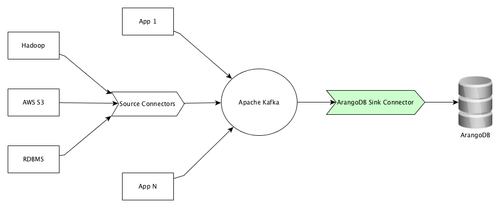

# Overview 
Kafka Connect ArangoDB  is a sink-only connector that pulls messages from Kafka and stores them in ArangoDB as JSON documents.

## Prerequisites
You should have [Apache ZooKeeper](https://zookeeper.apache.org) and [Apache Kafka](https://kafka.apache.org) installed and running on your machine. Please refer to the respective sites to download, install, and start ZooKeeper and Kafka. 

## What is ArangoDB?
ArangoDB is a NoSQL multi-model database. Its creators refer to it as a "native multi-model" database to indicate that it was designed specifically to allow key/value, document, and graph data to be stored together and queried with a common language. For more details, please refer to ArangoDB official [website.](https://www.arangodb.com/)

## What is Apache Kafka?
Apache Kafka is an open-source stream processing platform written in Scala and Java by the Apache Software Foundation. The project aims to provide a unified, high-throughput, low-latency platform for handling real-time data feeds. For more details, please refer to the [kafka home page](https://kafka.apache.org/).

## High-Level Architecture Diagram



## Data Mapping
ArangoDB is a schemaless document store/NoSQL database. Since we are working with plain JSON data, we don't need a schema to serialize and deserialize the messages. 

**For stand-alone mode**, please copy ```kafka_home/config/connect-standalone.properties``` to create ```kafka_home/config/arangodb-connect-standalone.properties``` file. Open ```kafka_home/config/arangodb-connect-standalone.properties``` and set the following properties to false.

```
key.converter.schemas.enable=false
value.converter.schemas.enable=false
```

**For distributed mode**, please copy ```kafka_home/config/connect-distributed.properties``` to create ```kafka_home/config/arangodb-connect-distributed.properties``` file. Open ```kafka_home/config/arangodb-connect-distributed.properties``` and set the following properties to false.

```
key.converter.schemas.enable=false
value.converter.schemas.enable=false
```

In distributed mode, if you run more than one worker per host, the ```rest.port``` settings must have different values for each instance. By default REST interface is available at 8083.

## How to deploy the connector in Kafka?
This is maven project. To create an [uber](https://maven.apache.org/plugins/maven-shade-plugin/index.html) jar, execute the following maven goals.

```mvn clean compile package shade:shade install```

Copy the artifact ```kafka-connect-arangodb-0.0.1-SNAPSHOT.jar``` to kakfa_home/lib folder.

Copy the [arangodb-sink.properties](https://github.com/sanjuthomas/kafka-connect-arangodb/blob/master/config/arangodb-sink.properties) file into kafka_home/config folder. Update the content of the property file according to your environment.

Alternatively, you may keep the ```kafka-connect-arangodb-0.0.1-SNAPSHOT.jar``` in another directory and export that directory into Kafka class path before starting the connector.

## How to start the connector in stand-alone mode?
Open a shell prompt, move to kafka_home and execute the following.

```
bin/connect-standalone.sh config/arangodb-connect-standalone.properties config/arangodb-sink.properties
```

## How to start the connector in distributed mode?
Open a shell prompt, move to kafka_home, and execute the following.

```
bin/connect-distributed.sh config/arangodb-connect-distributed.properties config/arangodb-sink.properties
```

## Contact
Create an issue in GitHub or write a line to kafka@sanju.org

## License
The project is licensed under the MIT license.
